# Digital Image Processing Tool

# 1. Introduction

This project was an auxiliary tool I developed as an image processing engineer, utilizing my free time. This project is developed in Visual Studio 2019 and includes two versions. One is developed by C++ and Windows Forms; the other is developed by C# and WPF. Although the company I worked for was equipped with the professional image processing and analysis software Matrox Inspector 7.0, I could not access its API and thus turned to OpenCV and EmguCV for development. The primary purpose of this auxiliary tool was to test and evaluate the effectiveness of OpenCV's and EmguCV's image-processing capabilities. Additionally, this tool integrated the APIs of industrial cameras from IDS and SENTECH, aiding in the real-time acquisition of image data.

The latest version of the application boasted a wealth of image-processing functions, including dilation, erosion, filtering, image segmentation, and video compression. When I left the company and handed over my responsibilities to my successor, I left this tool with them. Unfortunately, I forgot to update the latest version on my GitHub, resulting in only the initial version of the project being available here. In the future, when I have spare time, I plan not only to update this tool but also to further enhance its features to surpass its previous best version.

# 2. Implementation

## 2.1. Version of C# and WPF

The following is an example of image analysis through digital image processing technology in this auxiliary tool. 

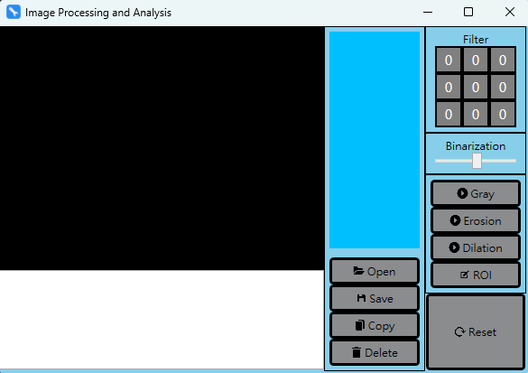

The above screenshot is application's initial user interface.

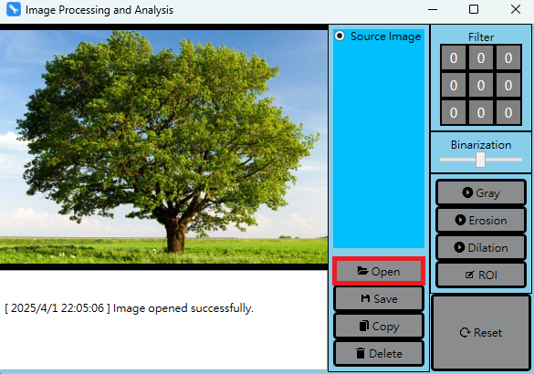

The above screenshot shows how to load the image.

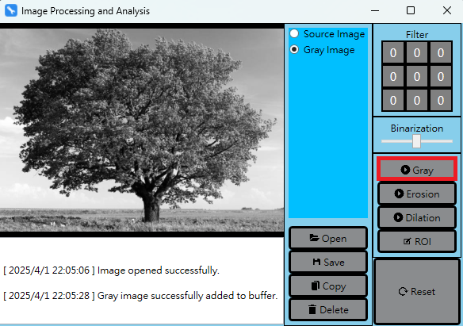

The above screenshot shows how to make the image grayscale.

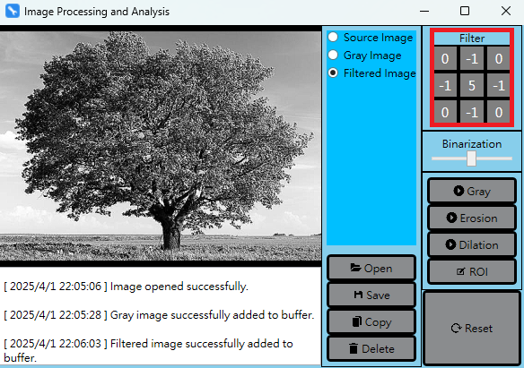

The above screenshot shows how to binarize the image.

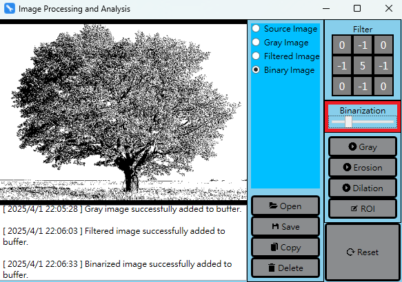

The above screenshot shows how to perform image processing using a custom filter.

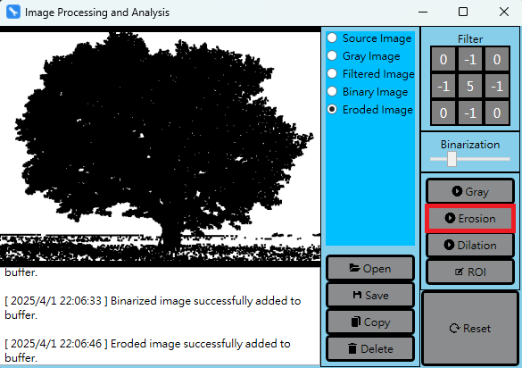

The above screenshot shows how to apply the dilation process.

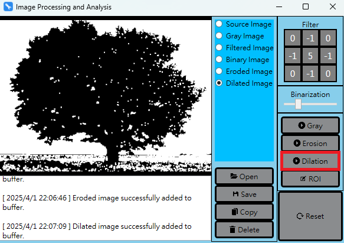

The above screenshot shows how to apply the erosion process.

## 2.2. Version of C++ and Windows Form

The following is an example of finding feature contours through digital image processing technology in this auxiliary tool. 

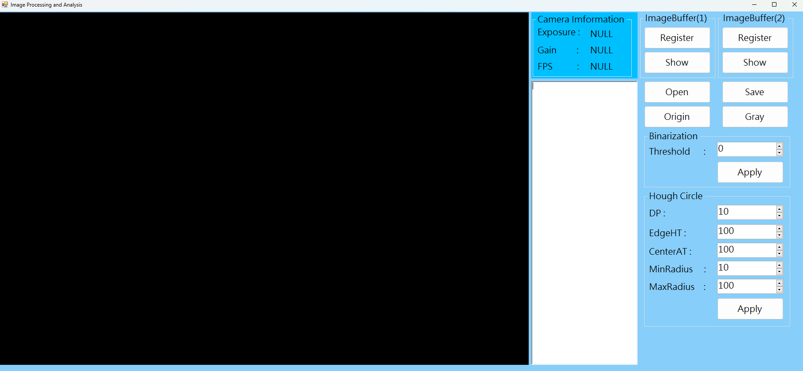

The above screenshot is application's initial user interface.

The above screenshot shows how to load the image.

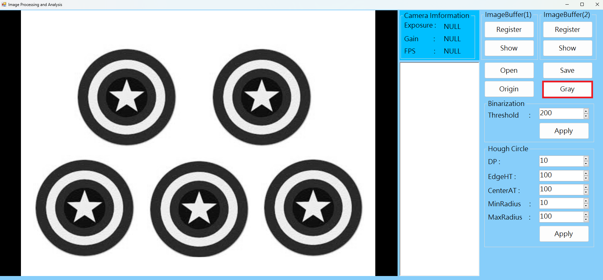

The above screenshot shows how to make the image grayscale.

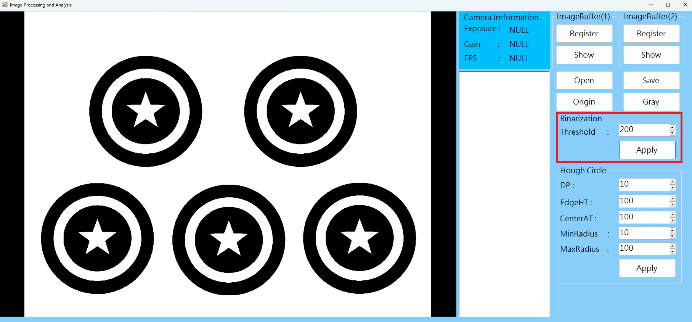

The above screenshot shows how to binarize the image.

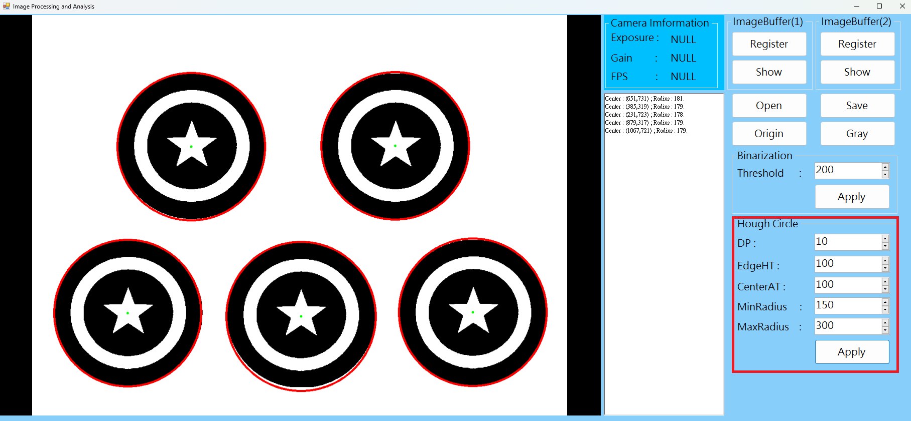

The above screenshot shows how to find circular contours.
